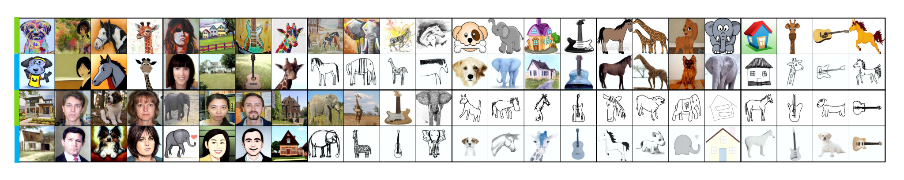

# Distribution Shift Inversion for Out-of-Distribution Prediction

This repository contains the offical implementation for our CVPR-2023 paper. 

**Distribution Shift Inversion for Out-of-Distribution Prediction**

[[arxiv]()] [[code](https://github.com/yu-rp/Distribution-Shift-Iverson/tree/master)] 

Runpeng Yu, Songhua Liu, Xingyi Yang, Xinchao Wang 

## Results
🛫 On average, adding in our method produces 2.26\% accuracy gain on multi-training domain generalization datasets and 2.28\% on single-training domain generalization datasets.<br>
🚀 on CdSprites5 dataset, our method generally elevates the classification accuracy from 50% to 90%.
<p align="justify">
  
  <br>
  <small><b>Fig. </b> Translated OoD samples from PACS dataset. Odd rows show the original OoD images, and even rows show their transformation results to the source distribution, obtained by the proposed method. The translator is trained only on the sorce domain. The style translation is sufficent. All of the translated images can be correctly classified by the ERM model trained on the source domain.</small>
    
</p>

## Introduction

In this tutorial-like document, we will lead you to finish the entire DSI by four steps: 
1. The Finetuning of Diffusion Model,
2. The Transformation,
3. The Training of OoD Algorithm,
4. The Inference.

Before diving into the instructions for each step, please prepare a `Data` folder for dataset storage. For better explanation, PACS dataset is used as an example in the repository.

## Finetuning of Diffusion Model

The code for the training and sampling of the Diffusion Model is based on the publicly available [Stable Diffusion](https://github.com/CompVis/stable-diffusion). The revelant code is in the folder `DiffusionModel`. The subfolder `DiffusionModel/yaml` contains the .yaml configuration files for the finetuning. The number in the name of each .yaml file is the domain index. The subfolder `DiffusionModel/checkpoint` originally contains the [sd-v1-4.ckpt](https://huggingface.co/CompVis) checkpoint, which is used as the starting point of our finetuning.  Due to the size limit, we emptry the subfolder `DiffusionModel\stable-diffusion-main\src`. To run the code, please download the content of this subfolder from [here](https://github.com/CompVis/stable-diffusion). To finetune the `sd-v1-4` on PACS, please use the following code
```
cd DiffusionModel/stable-diffusion-main

python main.py \
    -t \
    --base DiffusionModel/yaml/pacs_0.yaml \
    --gpus 0, \ # The number of GPUs
    --scale_lr False \
    --no-test True \
    --num_nodes 1 \
    --check_val_every_n_epoch 10 \
    --finetune_from "DiffusionModel/checkpoint/sd-v1-4-full-ema.ckpt"
```

The trianing output and the model checkpoints will be stored in the `DiffusionModel/stable-diffusion-main/logs`.

## Transformation

Given a finetuned Diffusion Model stored in `DiffusionModel/stable-diffusion-main/logs/exp-name/checkpoints/last.ckpt` and corresponding configuration file in `DiffusionModel/stable-diffusion-main/logs/exp-name/configs/config-name.yaml`, transformed samples can be generated using the following code

```
cd DiffusionModel/stable-diffusion-main

python scripts/augment.py \
    --scale 1.0 \
    --sample_amount 10  \
    --config "DiffusionModel/stable-diffusion-main/logs/exp-name/configs/config-name.yaml" \
    --ckpt "DiffusionModel/stable-diffusion-main/logs/exp-name/checkpoints/last.ckpt" \
    --ddim_steps 250 \
    --start_time 200 \
    --domain_index 0 \
    --dataset PACS_augmentation  \
    --outdir "output"
```
## OoD Algorithms
We use the [DomainBed](https://github.com/facebookresearch/DomainBed) for the training of the OoD Algorithms. 

## Inference
Due to the time consumption of the diffusion sampling, we did not conduct the inference in an online style. Instead, the inference is conducted by 
1. load the original OoD images and transformed images,
2. load OoD classification model, 
3. draw inference.

The relavent code is stored in folder `DSI`. Suppose the pretrained inference model is stored in `DSI\Predictor\checkpoints\model.pkl`, the inference procedure can be done with the following code.

```
cd Code

python -m torch.distributed.launch \
    --nproc_per_node=1 \
    --master_port 12465 \
    --nnodes=1 \
    -m DSI.main \
    -A lpm \
    -Pn DomainbedNet \
    -dncp `DSI\Predictor\checkpoints\model.pkl` \
    -sD PACS \
    -is 224 \
    -sd 1 \
    -sbs 64 \
    -sa 1 \
    -lpt 0.1 \
    -lpcd "lpcd.json" \ # file contains the path to the transformed samples
    -G pacs_c 
```

## License

This project is released under the [Apache 2.0 license](LICENCE).

## Citation

```bibtex
@article{yu2023distribution,
    author    = {Runpeng Yu, Songhua Liu, Xingyi Yang, Xinchao Wang},
    title     = {Distribution Shift Inversion for Out-of-Distribution Prediction},
    journal   = {The IEEE / CVF Computer Vision and Pattern Recognition Conference (CVPR)},
    year      = {2023},
}
```